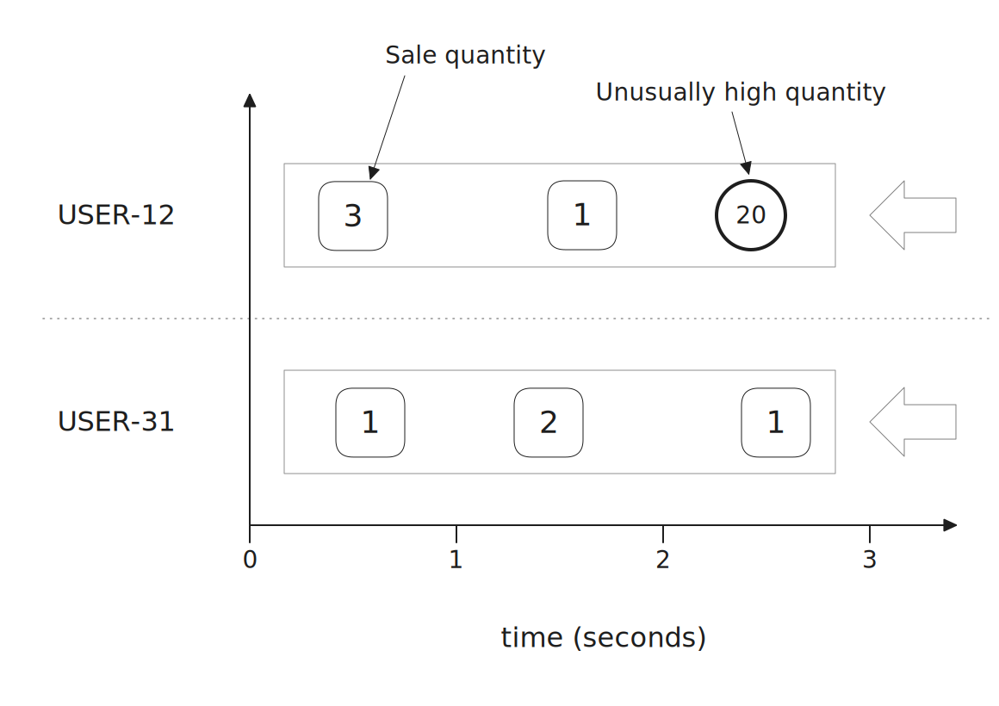
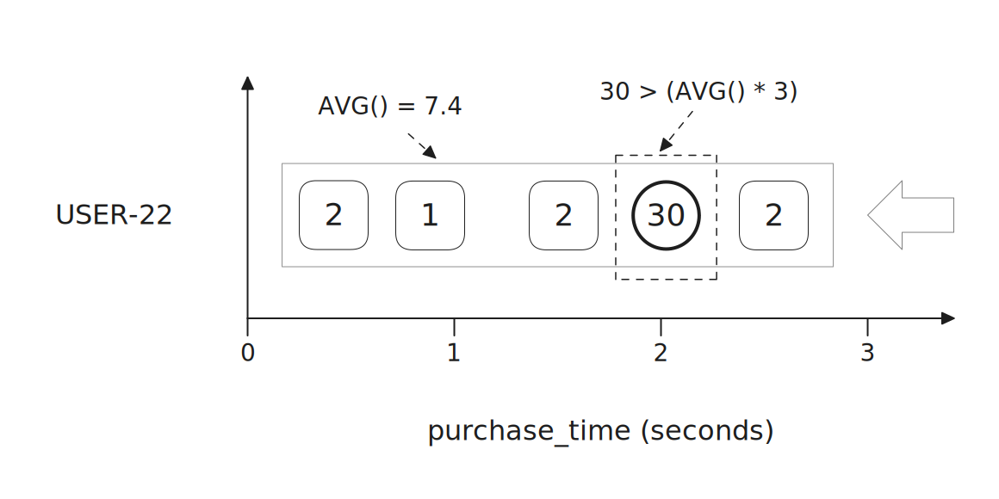
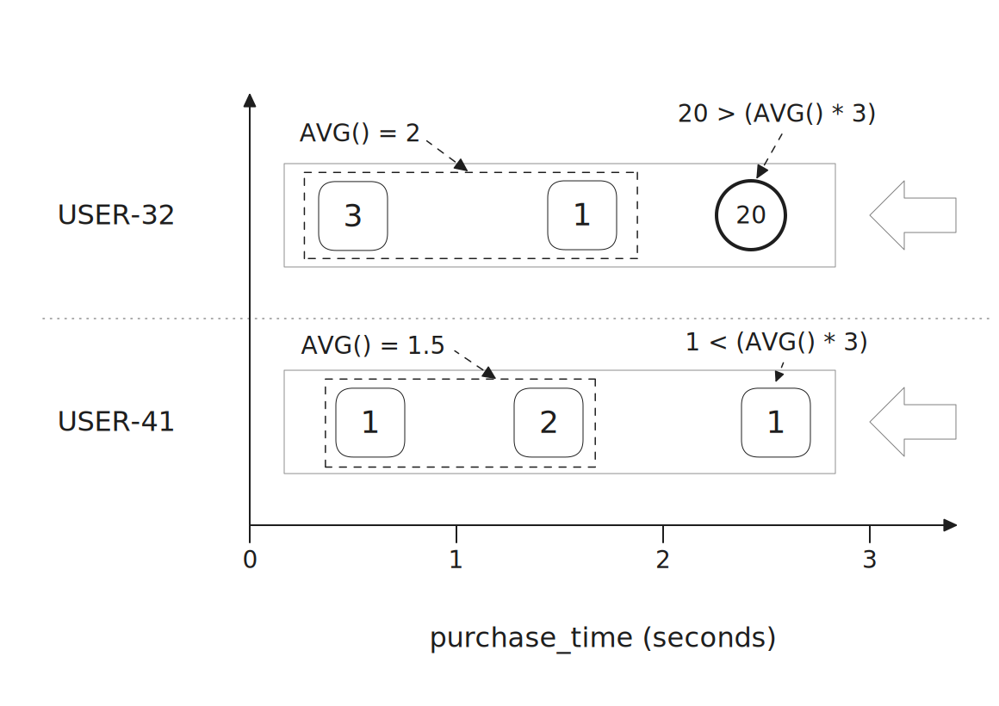
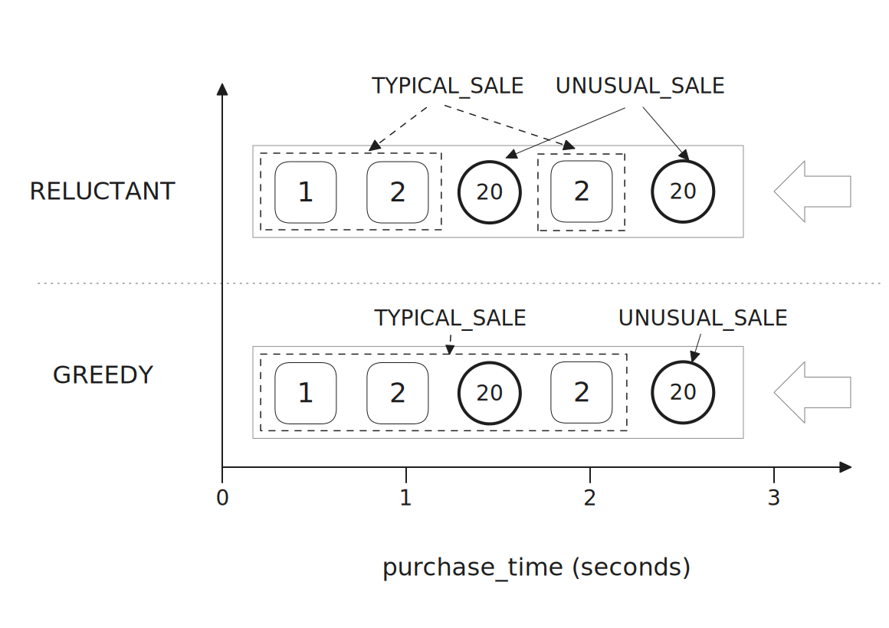
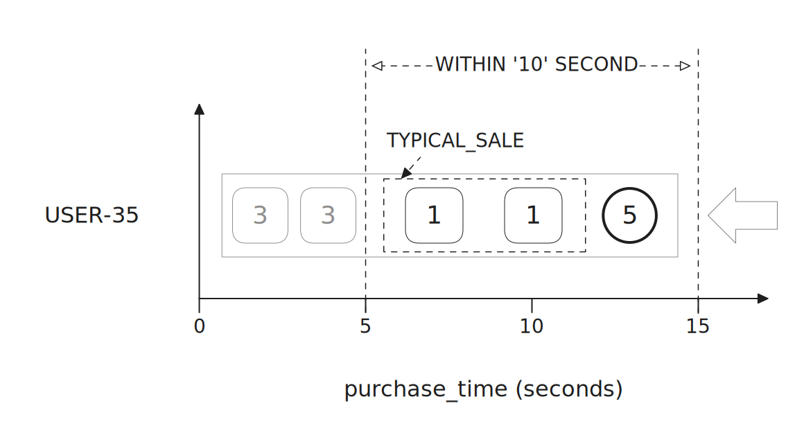
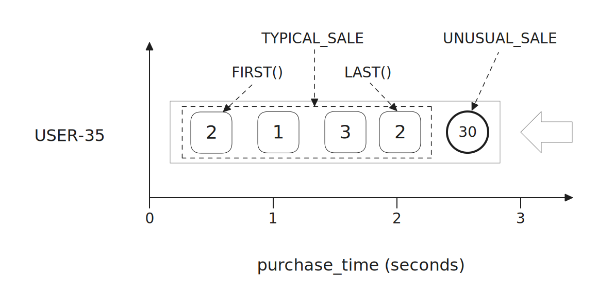
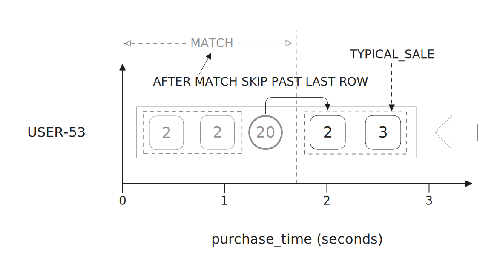

+++
title = 'Anomaly Detection'
+++

> Note: This tutorial is mainly focused on anomaly detection. For detailed information on working with [Flink ETL Jobs](https://nightlies.apache.org/flink/flink-docs-release-2.0/docs/learn-flink/etl/) and [Session Clusters](https://nightlies.apache.org/flink/flink-kubernetes-operator-docs-main/docs/custom-resource/overview/#session-cluster-deployments), look at the [Interactive ETL example](../interactive-etl/index.md).

[FlinkCEP](https://nightlies.apache.org/flink/flink-docs-release-2.0/docs/libs/cep/) (Complex Event Processing) is a Flink library made for finding patterns in data streams e.g. for detecting suspicious bank transactions. It can be accessed in [Flink SQL](https://nightlies.apache.org/flink/flink-docs-release-2.0/docs/dev/table/overview/) using the [`MATCH_RECOGNIZE` clause](https://nightlies.apache.org/flink/flink-docs-release-2.0/docs/dev/table/sql/queries/match_recognize/). In this tutorial, we will use Flink SQL and its `MATCH_RECOGNIZE` clause to detect and report suspicious sales across many users in real-time.

The tutorial is based on the StreamsHub [Flink SQL Examples](https://github.com/streamshub/flink-sql-examples) repository and the code can be found under the `tutorials/anomaly-detection` directory.

## Setup

> Note: If you want more information on what the steps below are doing, look at the [Interactive ETL example](../interactive-etl/index.md) setup which is almost identical.

1. Spin up a [minikube](https://minikube.sigs.k8s.io/docs/) cluster:

    ```shell
    minikube start --cpus 4 --memory 16G
    ```

2. From the main `tutorials` directory, run the data generator setup script:

    ```shell
    ./scripts/data-gen-setup.sh
    ```

3. (Optional) Verify that the test data is flowing correctly (wait a few seconds for messages to start flowing):

    ```shell
    kubectl exec -it my-cluster-dual-role-0 -n flink -- /bin/bash \
    ./bin/kafka-console-consumer.sh --bootstrap-server localhost:9092 --topic flink.sales.records
    ```

4. Deploy a [Flink session cluster](https://nightlies.apache.org/flink/flink-kubernetes-operator-docs-main/docs/custom-resource/overview/#session-cluster-deployments):

    ```shell
    kubectl -n flink apply -f anomaly-detection/flink-session-anomaly.yaml
    ```

## Scenario

### Source Data Table

The data generator application creates a topic (`flink.sales.records`) containing sales records.
The schema for this topic can be seen in the `data-generator/src/main/resources/sales.avsc`:

```json
{
  "namespace": "com.github.streamshub.kafka.data.generator.schema",
  "type": "record",
  "name": "Sales",
  "fields": [
    {"name": "user_id", "type": "string"},
    {"name": "product_id",  "type": "string"},
    {"name": "invoice_id",  "type": "string"},
    {"name": "quantity",  "type": "string"},
    {"name": "unit_cost",  "type": "string"}
  ]
}
```

> Note: All of the fields are of type `string` for simplicity. We'll `CAST()` `quantity` to an `INT` later on.

*(Assuming you have the data generator up and running as per the instructions in the [Setup](#setup) section, you can verify this by running the following command):*

```shell
$ kubectl exec -it my-cluster-dual-role-0 -n flink -- /bin/bash \
    ./bin/kafka-console-consumer.sh --bootstrap-server localhost:9092 \
        --topic flink.sales.records

user-11188&30299767430689348882
£838
user-9467&63188787247555258843
£971
...
```

| user_id | product_id | invoice_id          | quantity | unit_cost |
|---------|------------|---------------------|----------|-----------|
| user-11 | 188        | 3029976743068934888 | 2        | £838      |
| user-94 | 67         | 6318878724755525884 | 3        | £971      |

### High Sale Quantities

We want to detect if a user ordered a higher quantity than they usually do. This could be a sign that they made a mistake or their account has been hijacked, which could cause troubles for all parties involved if not dealt with promptly.



## Data analysis

### Setting up the Flink SQL CLI

We're going to use the Flink SQL CLI to interactively try various queries against our data.

First, let's port forward the Flink Job Manager pod so the Flink SQL CLI can access it:

```shell
kubectl -n flink port-forward <job-manager-pod> 8081:8081
```

The job manager pod will have the name format `session-cluster-anomaly-<alphanumeric>`, your `kubectl` should tab-complete the name.
If it doesn’t, then you can find the job manager name by running `kubectl -n flink get pods`.

Next, let's get the Flink SQL CLI up and running:

```shell
podman run -it --rm --net=host \
  quay.io/streamshub/flink-sql-runner:0.2.0 \
    /opt/flink/bin/sql-client.sh embedded
```

Once we're in, we can create a table for the sales records:

```sql
CREATE TABLE SalesRecordTable ( 
    invoice_id STRING, 
    user_id STRING, 
    product_id STRING, 
    quantity STRING, 
    unit_cost STRING, 
    `purchase_time` TIMESTAMP(3) METADATA FROM 'timestamp', 
    WATERMARK FOR purchase_time AS purchase_time - INTERVAL '1' SECOND 
) WITH ( 
    'connector' = 'kafka',
    'topic' = 'flink.sales.records', 
    'properties.bootstrap.servers' = 'my-cluster-kafka-bootstrap.flink.svc:9092', 
    'properties.group.id' = 'sales-record-group', 
    'value.format' = 'avro-confluent', 
    'value.avro-confluent.url' = 'http://apicurio-registry-service.flink.svc:8080/apis/ccompat/v6', 
    'scan.startup.mode' = 'latest-offset'
);
```

We can do a simple query to verify that the table was created correctly and that the data is flowing (give it a few seconds to start receiving data):

```sql
SELECT * FROM SalesRecordTable;
```

### Classifying "unusual" sales

There are many arbitrary ways we could use to define an "unusual" or "suspicious" sale quantity.

By looking at the data in the `SalesRecordTable`, we can observe that users typically order quantities between `1` and `3` (inclusive):

1. Fetch all the sales and group them by user:
   
   ```sql
   SELECT
        user_id,
        COUNT(user_id) AS total_sales_count
   FROM SalesRecordTable
   GROUP BY user_id;
   ```
   
2. For each user, take all of their sales and calculate the average quantity:
   
   ```sql
   SELECT
        user_id,
        COUNT(user_id) AS total_sales_count,
        AVG(CAST(quantity AS INT)) AS avg_quantity
   FROM SalesRecordTable
   GROUP BY user_id;
   ```
   
However, we can occasionally see sales with much higher quantities. Usually, between `10` and `30`.

If we wanted to, we could simply classify any quantity above `3` as "unusual":

```sql
SELECT *
FROM SalesRecordTable
WHERE quantity > 3;
```

> Note: This query might take a couple of seconds to return results, since the sales with high quantities are unusual.

Of course, this wouldn't be a particularly good measure. Specific users might always order higher quantities than the average user.

A more useful measure would involve calculating the average sale quantity of each user, and considering a quantity "unusual" if it is, for example, 3 times higher than that user's average.

The following query will return sales that match that condition:

```sql
SELECT sales.*, user_average.avg_quantity
FROM SalesRecordTable sales
JOIN (
       SELECT
           user_id,
           AVG(CAST(quantity AS INT)) AS avg_quantity
       FROM SalesRecordTable
       GROUP BY user_id
    ) user_average
ON sales.user_id = user_average.user_id
WHERE sales.quantity > (user_average.avg_quantity * 3);
```



While useful, the query above has several flaws:

- The "unusual" quantities are included in the `AVG()` calculation and skew it.
  - Ideally, we would not only exclude these sales from the `AVG()`, but maybe even reset the `AVG()` after an "unusual" sale.

- The `AVG()` calculation uses all of a user's sales, which might not be ideal.
  - This calculation could use a lot of computing resources, depending on the volume and frequency of sales.
  
  - Limiting the `AVG()` to sales made, for example, in the past week, might be more useful.

- The query would become much more complex if, for example, we only wanted to return a match if two "unusual" sales occurred one after another.
  - We would likely have to use some elaborate combination of [`WITH_TIES`](https://learn.microsoft.com/en-us/sql/t-sql/queries/top-transact-sql?view=sql-server-ver17#with-ties), [`OVER`](https://learn.microsoft.com/en-us/sql/t-sql/queries/select-over-clause-transact-sql?view=sql-server-ver17), and [`PARTITION BY`](https://learn.microsoft.com/en-us/sql/t-sql/queries/select-over-clause-transact-sql?view=sql-server-ver17). Assuming they're even supported.

`MATCH_RECOGNIZE` lets us easily and concisely solve these problems.

## Using `MATCH_RECOGNIZE`

### Simple pattern

We can use `MATCH_RECOGNIZE` to easily look for both simple and complex patterns.

For example, you can match any sale with a quantity higher than `3` like this:

```sql
SELECT *
FROM SalesRecordTable
MATCH_RECOGNIZE (
    ORDER BY purchase_time
    MEASURES
        SALE.quantity AS unusual_quantity,
        SALE.purchase_time AS unusual_tstamp
    PATTERN (SALE)
    DEFINE
        SALE AS
            CAST(SALE.quantity AS INT) > 3
);
```

[The `ORDER BY` clause is required](https://nightlies.apache.org/flink/flink-docs-release-2.0/docs/dev/table/sql/queries/match_recognize/#order-of-events), it allows us to search for patterns based on [different notions of time](https://nightlies.apache.org/flink/flink-docs-release-2.0/docs/dev/table/concepts/time_attributes/). With streaming, this ensures the output of the query will be correct, even if some sales arrive late.

We `DEFINE` a single `SALE` ["pattern variable"](https://nightlies.apache.org/flink/flink-docs-release-2.0/docs/dev/table/sql/queries/match_recognize/#defining-a-pattern) for our condition, then include it in our pattern. We then output both the quantity and timestamp of the unusual sale.

### Pattern navigation

Maybe instead, we want to look for two sales with the same quantity occurring one after another. This could be a sign that the user accidentally made the same order twice.

For now, let's simply match two sales occurring one after another, that both have a quantity of `2`. The [`PATTERN` syntax](https://nightlies.apache.org/flink/flink-docs-release-2.0/docs/dev/table/sql/queries/match_recognize/#defining-a-pattern) is similar to [regular expression syntax](https://en.wikipedia.org/wiki/Regular_expression), so we can easily extend our pattern from above using ["quantifiers"](https://nightlies.apache.org/flink/flink-docs-release-2.0/docs/dev/table/sql/queries/match_recognize/#defining-a-pattern) to accomplish that:

```sql
SELECT *
FROM SalesRecordTable
MATCH_RECOGNIZE (
    ORDER BY purchase_time
    MEASURES
        FIRST(SALE.quantity) AS first_unusual_quantity,
        FIRST(SALE.purchase_time) AS first_unusual_tstamp,
        LAST(SALE.quantity) AS last_unusual_quantity,
        LAST(SALE.purchase_time) AS last_unusual_tstamp
    PATTERN (SALE{2})
    DEFINE
        SALE AS
            CAST(SALE.quantity AS INT) = 2
);
```


Notice how the `SALE` pattern variable doesn't simply hold one value, it maps to multiple rows/sales/events. We're able to pass it to the `FIRST()` and `LAST()` functions to output the quantities from both the first and second matching sale respectively. These functions are specifically referred to as ["offset functions"](https://nightlies.apache.org/flink/flink-docs-release-2.0/docs/dev/table/sql/queries/match_recognize/#logical-offsets), since we use "logical offsets" to navigate the events mapped to a particular pattern variable.

### Useful pattern

Finally, let's use some techniques from the useful measure/query in the ["Classifying "unusual" sales"](#classifying-unusual-sales) section in a `MATCH_RECOGNIZE`:

```sql
SELECT *
FROM SalesRecordTable
MATCH_RECOGNIZE (
    PARTITION BY user_id
    ORDER BY purchase_time
    MEASURES
        UNUSUAL_SALE.quantity AS unusual_quantity,
        UNUSUAL_SALE.purchase_time AS unusual_tstamp,
        AVG(CAST(TYPICAL_SALE.quantity AS INT)) AS avg_quantity,
        FIRST(TYPICAL_SALE.purchase_time) AS avg_first_sale_tstamp,
        LAST(TYPICAL_SALE.purchase_time) AS avg_last_sale_tstamp
    ONE ROW PER MATCH
    AFTER MATCH SKIP PAST LAST ROW
    PATTERN (TYPICAL_SALE+? UNUSUAL_SALE) WITHIN INTERVAL '10' SECOND
    DEFINE
        UNUSUAL_SALE AS
            UNUSUAL_SALE.quantity > AVG(CAST(TYPICAL_SALE.quantity AS INT)) * 3
);
```

This query might look intimidating at first, but becomes easier to understand once we break it down. 

---

#### `ORDER BY purchase_time`

Like previously mentioned, this clause allows us to look for pattens based on time. In our case, the purchase time of the sale.

---

#### `PARTITION BY user_id`

This is similar to `GROUP BY user_id` in the original query, it lets us calculate `AVG()` values and find matches for each user separately.

Unlike with a global user average, we won't receive false positives because of a minority of users who order in large quantities often.



---

#### `PATTERN (TYPICAL_SALE+? UNUSUAL_SALE)`

We use two "pattern variables" in our pattern:

- `TYPICAL_SALE`: We use this to match all the sales made before an "unusual" sale.
  - By not specifying a condition for this variable in `DEFINE`, the [default condition](https://nightlies.apache.org/flink/flink-docs-release-2.0/docs/dev/table/sql/queries/match_recognize/#define--measures) is used, which evaluates to `true` for every row/sale.
  
  - Notice how we use `TYPICAL_SALE+?` instead of just `TYPICAL_SALE`.
    - `+` and `?` are both "quantifiers", just like the [`{ n }` in `SALE{2}` from one of our previous queries](#classifying-unusual-sales).
      - We use them to match "one or more" typical sales, since an `AVG()` of zero sales isn't very useful.
    
    - By combining both of those "quantifiers" into `+?`, we make a ["reluctant quantifier"](https://nightlies.apache.org/flink/flink-docs-release-2.0/docs/dev/table/sql/queries/match_recognize/#greedy--reluctant-quantifiers).
      - This [reduces memory consumption](https://nightlies.apache.org/flink/flink-docs-release-2.0/docs/dev/table/sql/queries/match_recognize/#controlling-memory-consumption) by specifying to match as few typical sales as possible.
      
      - Since `TYPICAL_SALE` matches every row/sale by default, we need to use a "reluctant quantifier", or the query might match all rows and never finish.

- `UNUSUAL_SALE`: We use this to match an "unusual" sale.
  - Unlike in our original query, we're able to easily calculate an `AVG()` of just typical sales by using `AVG(TYPICAL_SALE.quantity)`.
  
    - This prevents "unusual" sales from skewing our `AVG()` and creating false positives.



We append `WITHIN INTERVAL '10' SECOND` after the pattern to set a ["time constraint"](https://nightlies.apache.org/flink/flink-docs-release-2.0/docs/dev/table/sql/queries/match_recognize/#time-constraint).

> Note: We use an `INTERVAL` of `10 SECOND`s for quick user feedback in this tutorial. In a real situation, you would probably use something like `WITHIN INTERVAL '1' HOUR`.

This provides several benefits:

- Only the sales made within the last `10 SECOND`s are used.
  - Memory use becomes more efficient, since we can prune sales older than this.

- Our `AVG()` calculation changes from a typical arithmetic mean to a [simple moving average](https://en.wikipedia.org/wiki/Moving_average).
  - There are benefits and downsides to both approaches.
  
    - In our case, sales are frequent, so only using recent sales can be beneficial.



---

#### `FIRST(TYPICAL_SALE.purchase_time) AS avg_first_sale_tstamp`, `LAST(...)`

We use `FIRST()` and `LAST()` to output timestamps for the first and last sales that were used to calculate our `AVG()`. This information lets us know exactly which previous sales were used to determine an "unusual" sale. 



---

#### `ONE ROW PER MATCH`

Currently, this is the only supported ["output mode"](https://nightlies.apache.org/flink/flink-docs-release-2.0/docs/dev/table/sql/queries/match_recognize/#output-mode).

As the name suggests, it indicates to only output one row when a match is found.

Once released, `ALL ROWS PER MATCH` will be able to output multiple rows instead.

---

#### `AFTER MATCH SKIP PAST LAST ROW`

This is pretty self-explanatory, we skip past the last row/sale of a match before looking for the next match.

Other ["After Match Strategies"](https://nightlies.apache.org/flink/flink-docs-release-2.0/docs/dev/table/sql/queries/match_recognize/#after-match-strategy) are available for skipping to different rows and pattern variable values inside the current match. However, they aren't particularly useful in our scenario.

Our strategy skips past the "unusual" sale of the current match. This prevents the "unusual" sale from being wrongly used as the first "typical" sale of the next match and skewing the `AVG()`.


